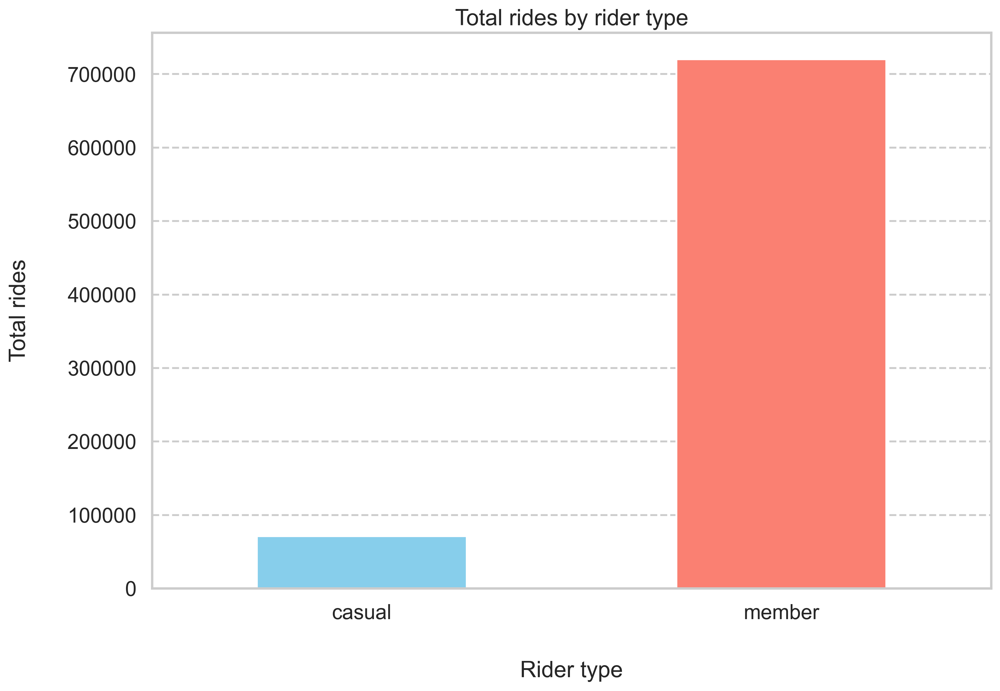
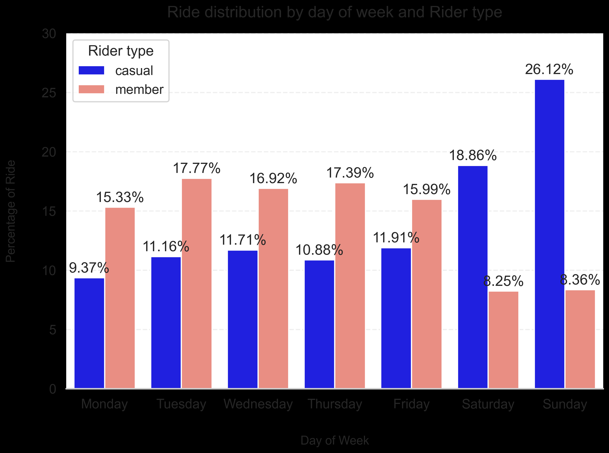

# Cyclistic Bike-Share Case Study

## Project Overview

This project analyzes historical Cyclistic bike-share trip data to understand how casual riders and annual members use the service differently. The goal is to generate insights that can support marketing strategies focused on converting casual riders into members.

## Business Task

Identify key behavioral differences between casual riders and members using trip data from the first quarter of 2019 and 2020.

## Files

- `notebook.ipynb`: full case study workflow, including data preparation, cleaning, analysis, visualizations, conclusions, and recommendations
- `Divvy_Trips_2019_Q1.csv`: raw trip data for Q1 2019
- `Divvy_Trips_2020_Q1.csv`: raw trip data for Q1 2020

## Tools Used

- Python
- pandas
- matplotlib
- seaborn

## Workflow

1. Defined the business problem
2. Prepared and reviewed the data sources
3. Cleaned and transformed the datasets
4. Performed exploratory data analysis
5. Built visualizations to communicate findings
6. Developed conclusions and recommendations

## Key Findings

- Most recorded rides in the dataset were taken by members.
- Casual riders had longer median ride durations than members.
- Casual riders showed a stronger weekend riding pattern.
- Members showed a stronger weekday riding pattern.
- March had the highest share of rides for both rider groups in the first quarter.

## Sample Visualizations

### Total Rides by Rider Type

### Ride Distribution by Day of Week

## Recommendations

- Promote membership as a cost-effective option for casual riders who take longer trips.
- Focus campaigns on weekends and high-activity periods when casual riders are more active.
- Expand the analysis with additional time periods, route-level data, and customer-level insights if available.

## Data Source

The raw datasets used in this project were not uploaded to this repository because of GitHub file size limits. They can be downloaded from the official Divvy trip data source:

- https://divvy-tripdata.s3.amazonaws.com/index.html

## Notes

- This project uses first-quarter data only.
- Seasonal patterns suggested in the notebook would need additional monthly data to confirm.
