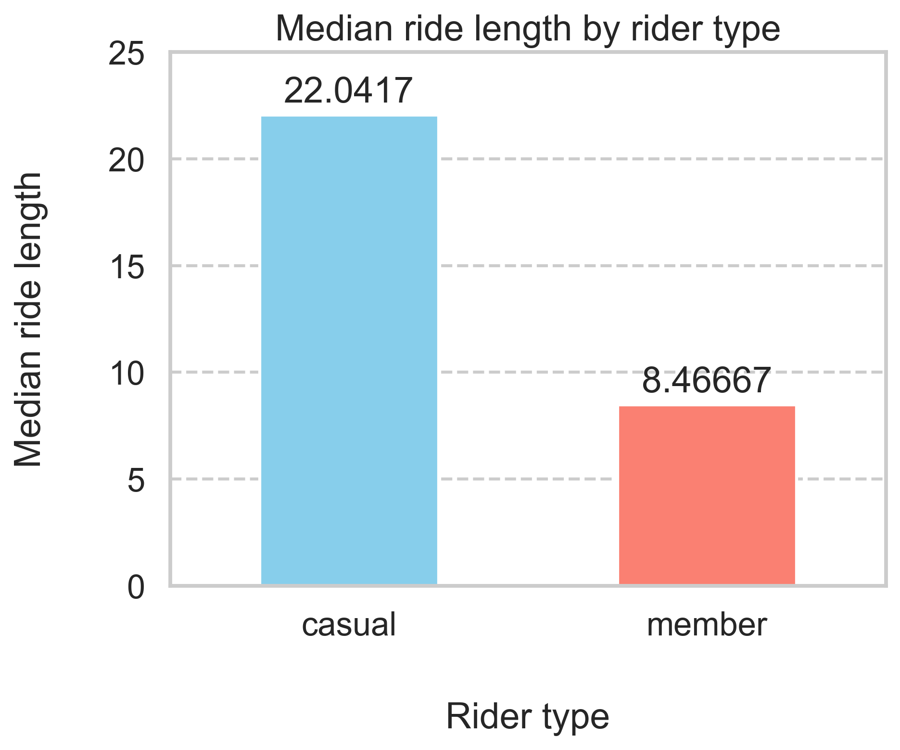
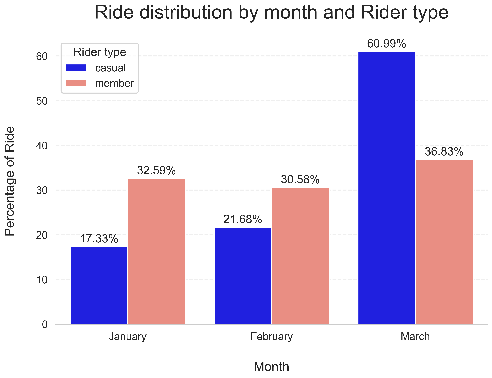

# Cyclistic Bike-Share Case Study

## Executive Summary

Casual riders primarily use the service for longer, weekend leisure trips, while members rely on it for consistent weekday commuting. This behavioral gap presents a clear opportunity to convert casual users through targeted weekend campaigns and cost-focused membership positioning.

## Project Overview

This project analyzes historical Cyclistic bike-share trip data to understand how casual riders and annual members use the service differently. The objective is to generate data-driven insights that support marketing strategies aimed at converting casual riders into long-term members.

## Business Task

Identify key behavioral differences between casual riders and members using trip data from the first quarter of 2019 and 2020, and translate these insights into actionable business recommendations.

## Files

- `notebook.ipynb`: full case study workflow, including data preparation, cleaning, analysis, visualizations, conclusions, and recommendations
- `Divvy_Trips_2019_Q1.csv`: raw trip data for Q1 2019
- `Divvy_Trips_2020_Q1.csv`: raw trip data for Q1 2020

## Tools Used

- Python
- pandas
- matplotlib
- seaborn

## Workflow

1. Defined the business problem
2. Prepared and reviewed the data sources
3. Cleaned and transformed the datasets
4. Performed exploratory data analysis
5. Built visualizations to communicate findings
6. Developed conclusions and recommendations

## Key Findings

- Members account for the majority of total rides, indicating strong adoption among frequent users.
- Casual riders exhibit longer median ride durations, suggesting they primarily use the service for leisure rather than routine transportation.
- Casual riders show a pronounced weekend usage pattern, reinforcing their recreational behavior.
- Members demonstrate consistent weekday usage, indicating reliance on the service for commuting and daily mobility.
- March shows the highest share of rides for both groups, suggesting a seasonal increase in demand toward the end of Q1.

## Sample Visualizations

### Total Rides by Rider Type

### Ride Distribution by Day of Week

## Recommendations

- Position membership as a cost-effective solution for casual riders who frequently take longer trips, emphasizing potential savings over time.
- Launch targeted weekend marketing campaigns, as casual rider activity peaks during this period.
- Introduce trial-based or short-term membership options to reduce the barrier to conversion.
- Expand the analysis with additional time periods, route-level data, and customer-level insights to refine targeting strategies.

## Data Source

The raw datasets used in this project were not uploaded to this repository because of GitHub file size limits. They can be downloaded from the official Divvy trip data source:

- https://divvy-tripdata.s3.amazonaws.com/index.html

## Notes

- The analysis is based on first-quarter data only; seasonal trends may not be fully captured.
- Lack of demographic and customer-level data limits deeper segmentation.
- Behavioral insights are inferred from trip patterns rather than explicitly stated user intent.
